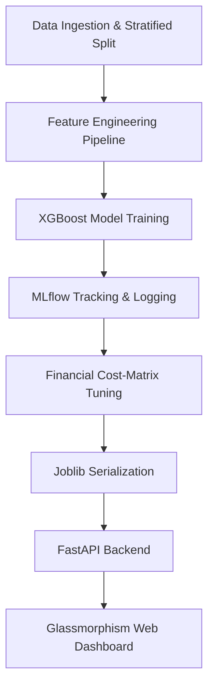
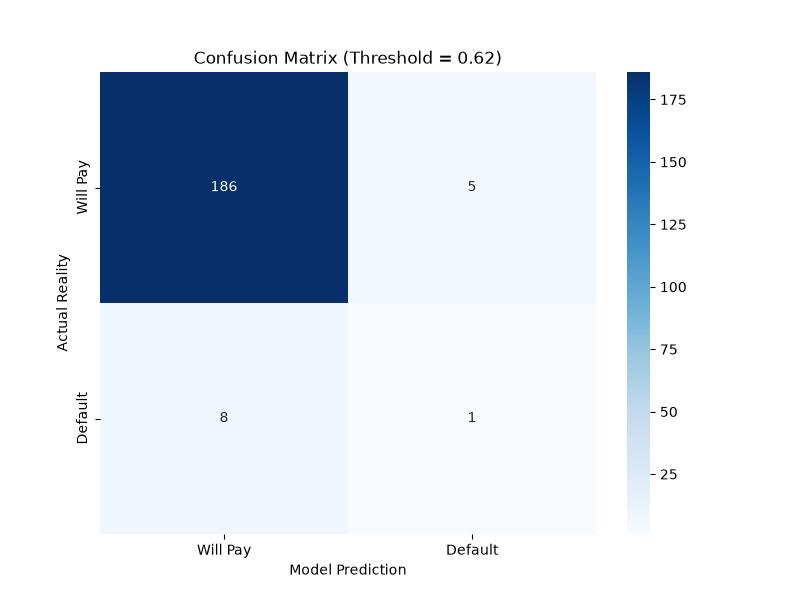
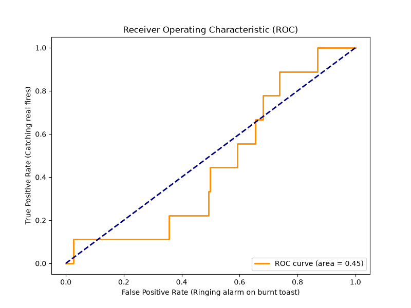

# End-to-End AI Credit Risk Pipeline 🏦


An end-to-end Machine Learning pipeline that predicts loan default risk. This project moves beyond standard accuracy metrics by implementing **Custom Financial Cost-Matrix Tuning**, optimizing the probability threshold to maximize raw business profit.

## 🌟 Business Impact
By analyzing the cost of False Positives (losing $10,000 on a default) vs False Negatives (losing $1,000 in interest on a rejected good customer), we tuned the classification threshold from the default `0.50` to an optimal **`0.62`**. 

On a simulated batch of 200 applicants, this custom threshold increased bank profit from **$445,000 to $505,000** compared to a naive model.

## 🏗️ System Architecture



## 📊 Model Evaluation
We utilized MLflow to track parameters and generated visualization reports for threshold analysis.

| Confusion Matrix (Threshold = 0.62) | Receiver Operating Characteristic |
| :---: | :---: |
|  |  |

## 🚀 Getting Started

### 1. Installation
Clone the repository and set up your virtual environment:
```bash
git clone https://github.com/vedantchaskar01/Credit-Risk-Prediction.git
cd Credit-Risk-Prediction
python -m venv venv
.\venv\Scripts\activate
pip install -r requirements.txt
```

### 2. Running the API & Dashboard
Start the FastAPI Waiter:
```bash
uvicorn app:app --reload
```
Once the server is running, simply open `frontend/index.html` in your web browser to access the beautiful interactive dashboard!

## 📁 Project Structure
- `src/components/` - The core ML pipeline (Ingestion, Engineering, Training, Evaluation).
- `app.py` - FastAPI backend server.
- `frontend/` - HTML/CSS/JS for the interactive web dashboard.
- `reports/figures/` - Output visual evaluation charts.
- `models/` - Serialized `.pkl` model artifacts.
